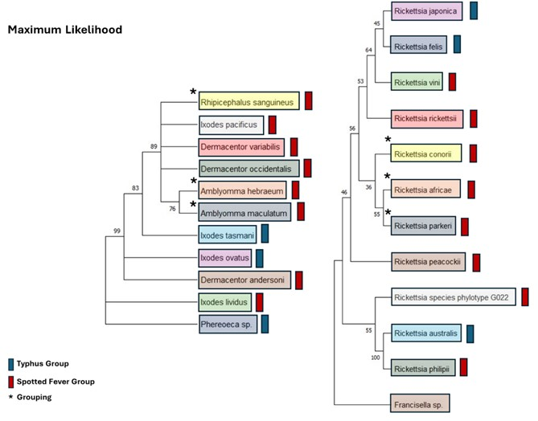

#Final Paper
# The coevolution of Rickettsial endosymbionts and their tick vectors
The Co-phylogenetics of Pathogenic Rickettsia and their Tick Vectors
Nicholas Woronchuk1*
1Department of Biological Sciences, California Polytechnic State University, Humboldt *Corresponding Author
Received on 6 May 2024

Abstract

Rickettsia is a genus of gram-negative bacteria vectored by hematophagous arthropods. The coevolution of tick-borne pathogens with their tick vectors has led to the development of different strategies employed by these pathogens for successful transmission. High prevalence of rickettsial endosymbionts among ticks implies a well-established dependency, but such highly prevalent dependencies have not been observed among pathogenic Rickettsia and their respective vectors. Coevolutionary analysis, through co-phylogenetics can potentially offer insight into the distribution of rickettsial pathogens in different tick species. Concatenated super matrixes were generated and analyzed using Maximum Parsimony and Maximum Likelihood. There appears to be phylogenetic evidence for the co-evolution of R. parkerii, R. africae, and R. conorii vectors.

Key Words: endosymbionts, coevolution, vector-specific

Introduction

Rickettsia is a genus of gram-negative bacteria vectored by hematophagous arthropods (Salje et al. 2021). Pathogenic Rickettsia are responsible for numerous febrile diseases in mammals, including spotted fever and typhus fever rickettsiosis (Morand and Walther 2018). Over the past 40 years, the incidence of rickettsial diseases has increased and has seen a continuous increase since 1970 (Morand et al. 2020). In recent years, cases of tick-borne diseases, such as Lyme borreliosis (Swei et al. 2020a) and reported cases of spotted fever rickettsiosis in the United States (Biggs et al. 2016) have experienced a rise. Hard ticks are the most common vector for vector borne zoonotic diseases and are the primary vector of Rickettsia (Swei et al. 2020). Understanding the distribution and prevalence of ticks and their associated pathogens can help assess the potential risk tick-borne diseases pose to humans and animals (Halliday et al. 2007).
The coevolution of tick-borne pathogens with their tick vectors has led to the development of different strategies employed by these pathogens for successful transmission and manipulation of their host (Weinert et al. 2015). Šimo et al. (2017) notes the ability of some bacteria to manipulate molecules in the salivary glands to promote pathogen exchange during co-feeding and pathogenicity enhancement. Rickettsia were found to exploit immunomodulating  factors in  the saliva of Ambylomma maculatum during feeding (Banajee et al. 2015; Šimo et al. 2017) Foley et al. (2008) presents the possibility of Anaplasma phagocytophilum closely evolving with Ixodes ricinus, leading to optimized local infectivity in North America. Thu et al. (2019) found strong support for species-specific association between Rickettsia and ticks in Japan based on the rickettsial phenotype. High prevalence of rickettsial endosymbionts among ticks implies a well-established dependency (Cheng et al. 2013), but such highly prevalent dependencies have not been observed among pathogenic Rickettsia and their respective vectors.
Coevolutionary analysis, through co-phylogenetics can potentially offer insight into the distribution of rickettsial pathogens in different tick species. Using the gltA, ompA, and 16s rRNA rRNA genes of rickettsial pathogens, and the partial actin sequences, 16s rRNA, and cox1 of ticks, I conducted a co-phylogenetic analysis using Maximum Parsimony and Maximum Likelihood. A phylogeny of ticks, hereafter referred to as vectors, was constructed alongside a phylogeny of Rickettsia to determine the potential for coevolutionary development based on a dependence for pathogen transmission. After tree construction, a comparison of both trees may reveal a preferential association of certain Rickettsia species with specific vectors.

Materials and Methods

Data Collection
Vector – Pathogen (VP) associations were identified using literature available on PubMed and the CDC. Associations were included in this study if ticks were the primary vector or one of the primary vectors for a specific species of Rickettsia. A partial actin sequences, 16s rRNA, and cox1 genes were used for phylogenetic analysis for vectors, while the gltA, ompA, and 16s rRNA genes were used for Rickettsia species. Lack of sequence availability resulted in the inclusion one or a subset of genes (Table 1). Sequences were downloaded as FASTA files and edited in a text editor for formatting compliance with phylogenetic software AliView and IQ-Tree.

Phylogenetic Analysis
VP sequences were aligned in AliView, respectively and concatenated. Concatenated super matrixes were uploaded into IQ-Tree and analyzed using Maximum Parsimony (MP) and Maximum Likelihood (ML) with 100 replicates. Phereoeca sp. (bagworm moth) was used as an outgroup for the vector phylogeny (Araújo et al. 2021). Niebylski et al. (1997) identified an endosymbiont belonging to the Francisella genus in Dermacentor andersoni. Francisella sp. was used as an outgroup due to its unique phylogeny from Rickettsia and its non-pathogenic character state. Another endosymbiont of D. andersoni was included as it also non-pathogenic, R. peacockii (Mattila et al. 2007). The inclusion of two different species of endosymbionts served as a comparison against pathogenic Rickettsia species. 

Results

Maximum Parsimony

For Maximum Parsimony (MP), a basally orientated polytomy was present for Phereoeca sp. and D. occidentalis, while the associated Rickettsia species, for each vector, R. felis and R. philipii exhibited a resolved phylogeny with a deeply rooted polyphyletic grouping (Figure 1). D. andersoni, D. variabilis, A. herbaeum, A. maculatum, and Rh. sanguineus formed a highly supported polytomy (96), while their associated Rickettsia species, R. peaockii, R. conorii, R. rickettsia, R. parkerii, and R. africae exhibited a completely resolved phylogeny with a grouping reflective of their vectors.  I. ovatus and I. lividus were sister taxa, sharing a monophyletic grouping with comparatively high bootstrap support, while R. japonica and R. vini shared a polyphyletic grouping. R. philipii and R. australis were sister taxa, forming a more recent monophyletic grouping, with high bootstrap support. R. japonica was the only Typhus Group (TG) species not grouped with the other two TG Rickettsia, R. felis and R. australis (Figure 1). 

Maximum Likelihood

For Maximum Likelihood (ML), only two resolved lineages were observed for vectors. I. tasmani exhibited a resolved lineage, along with A. maculatum and A. herbarium, which formed a resolved monophyletic lineage (Figure 2). A. maculatum and A. herbarium formed their lineage within the polytomy consisting of D. occidentalis, D. variabilis, I. pacificus, and Rh. sanguineus. The grouping of A. maculatum and A. herbarium was reflected with their associated Rickettsia species, R. parkerii and R. africae. The polytomy with Rh. sanguineus was reflected with its associated Rickettsia species, R. conorii. Interestingly, and contrary to the MP tree, R. japonica and R. australis switched positions, so that R. australis is now the only TG not grouped with the others two TG species (Figure 2).

Fig 1. Maximum Parsimony (Right) Tick vectors associated with SFG Rickettsia were largely grouped together, the exception being I. lividus which was grouped with vectors of TG Rickettsia. (Left) Rickettsia are grouped together by disease group, apart from R. philipii (SFG) being grouped with TG Rickettsia and R. japonica being basally grouped with members of the SFG. 

Fig 2. Maximum Likelihood (Right) Ticks vectors associated with TG species are grouped basally towards the base of the tree, apart from D. andersoni. (Left) For the Rickettsia tree, two members of the TG share more bootstrap support with members of the SFG, R. australis (TG) and R. philipii (SFG), and R. felis (TG) and R. vini (SFG).

Discussion

Interestingly, R. philipii (SFG) and R. austrlais (TG) were monophyletically grouped as sister taxa using ML with a bootstrap value of 100 (Figure 1), contradictory to Murray et al. (2016), who places R. philipii at a more deeply rooted position within the more recently diverged SFG. Accordingly, R. austrlais would presumably share greater bootstrap support with R. japonica, followed by R. peacockii (Murray et al. 2016), although this was not observed in this study. Alternatively, other phylogenies place R. australis in the Transitional Group, rather than the Typhus group (Weinert et al. 2009).
ML offered a resolved phylogeny for both Amblyomma species, which were grouped monophyletically as sister taxa within a polytomy of D. occidentalis, D. variabilis, I. pacificus, and Rh. sanguineus. Amblyomma having more recently diverged from the more basal Ixodes genus are grouped together along with most of the Dermacentor ticks (Wang et al. 2019). Most of the Ixodes ticks are grouped basally to both Ambyomma, Rhipicephalus, and Dermacentor, except for I. pacificus, consistent with other tick phylogenies (Wang et al. 2019). 
It seems that ML offered the greatest amount of congruence between the phylogenies for Rickettsia and their vectors. A. maculatoum appears to share a similar topology with R. parkeri and A. herbraeum with R. africae. A. maculatoum and R. parkeri are native to North America along the gulf and southern coasts of the United States (Benham et al. 2021), while A. herbraeum and R. africae are both native to south-east Africa (Bournez et al. 2015). These two geographically isolated populations of vectors and pathogens seem to experience evolutionary pressure that is reflected phylogenetically. Like non-pathogenic endosymbionts, certain pathogenic Rickettsia may have evolved an evolutionary dependence on certain species, giving rise to specialist and generalist species. 

Limitations

The use of only one sequence for each vector had discernable influences on the absence of a resolved phylogeny (Figure 2). All vector species were analyzed with only one sequence and exhibited polytomies for both methods. Multiples genes with complete sequences should be included to avoid this problem. Subsequent analysis of vectors should have at least two genes for each species. Additionally, the maternally inherited mitochondrial genes may exhibits variable rates of evolutionary change and may experience recombination (Gissi et al. 2008; Li et al. 2022), therefore, the inclusion of genes from different origins may skew results. Members of Chelicerata can be difficult to barcode as they often have congeneric genomes (Gissi et al. 2008). In contrast, while phylogenies for Rickettsia species exhibited well resolved lineages, there was poor bootstrap support. Variable numbers of genes included for each species may have contributed to the overall low support. Additional sequences need to be included to generate a more robust phylogeny. More resolved trees for vectors and pathogens presents the possibility of direct quantitative topology comparisons. 

Conclusions

Greater statistical rigor and more fully resolved lineages for the ML offers greater support for the Rickettsia phylogeny and the phylogeny of their associated vectors. Both species of Amblyomma share a monophyletic group branching from a polytomy that includes Rh. sanguinus. This grouping is consistent with Wang et al. (2019), with Ambylomma being ancestral to Rhipicephalus. Associated Rickettsia mirror this grouping as R. parkerii, R. africae, and R. conorii form a monophyletic group. Although not overwhelming, there appears to be phylogenetic evidence for the co-evolution of VP association for ticks and Rickettsia. It seems that geographic distribution, such as those in North America and Africa can play a role in preferential selection by certain species of Rickettsia due to prolonged associations over evolutionary time. 

References

Araújo FS de, Barcelos RM, Mendes TA de O, Mafra C. 2021. Molecular Evidence of Rickettsia felis in Phereoeca sp. Rev Bras Parasitol Vet. 30(1):e015620. doi:10.1590/S1984-29612021017.
Banajee KH, Embers ME, Langohr IM, Doyle LA, Hasenkampf NR, Macaluso KR. 2015. Amblyomma maculatum Feeding Augments Rickettsia parkeri Infection in a Rhesus Macaque Model: A Pilot Study. PLoS One. 10(8):e0135175. doi:10.1371/journal.pone.0135175.
Benham SA, Gaff HD, Bement ZJ, Blaise C, Cummins HK, Ferrara R, Moreno J, Parker E, Phan A, Rose T, et al. 2021. Comparative population genetics of Amblyomma maculatum and Amblyomma americanum in the mid-Atlantic United States. Ticks Tick Borne Dis. 12(1):101600. doi:10.1016/j.ttbdis.2020.101600.
Biggs HM, Behravesh CB, Bradley KK, Dahlgren FS, Drexler NA, Dumler JS, Folk SM, Kato CY, Lash RR, Levin ML, et al. 2016. Diagnosis and Management of Tickborne Rickettsial Diseases: Rocky Mountain Spotted Fever and Other Spotted Fever Group Rickettsioses, Ehrlichioses, and Anaplasmosis - United States. MMWR Recomm Rep. 65(2):1–44. doi:10.15585/mmwr.rr6502a1.
Bournez L, Cangi N, Lancelot R, Pleydell DRJ, Stachurski F, Bouyer J, Martinez D, Lefrançois T, Neves L, Pradel J. 2015. Parapatric distribution and sexual competition between two tick species, Amblyomma variegatum and A. hebraeum (Acari, Ixodidae), in Mozambique. Parasit Vectors. 8:504. doi:10.1186/s13071-015-1116-7.
CDC. 2023 Sep 11. Tickborne diseases of the United States | CDC. Centers for Disease Control and Prevention. [accessed 2024 Apr 3]. https://www.cdc.gov/ticks/diseases/index.html.
Cheng D, Vigil K, Schanes P, Brown RN, Zhong J. 2013. Prevalence and burden of two rickettsial phylotypes (G021 and G022) in Ixodes pacificus from California by real-time quantitative PCR. Ticks Tick Borne Dis. 4(4):280–287. doi:10.1016/j.ttbdis.2012.12.005.
Dantas-Torres F. 2010. Biology and ecology of the brown dog tick, Rhipicephalus sanguineus. Parasit Vectors. 3:26. doi:10.1186/1756-3305-3-26.
Dergousoff SJ, Gajadhar AJA, Chilton NB. 2009. Prevalence of Rickettsia species in Canadian populations of Dermacentor andersoni and D. variabilis. Appl Environ Microbiol. 75(6):1786–1789. doi:10.1128/AEM.02554-08.
Foley J, Nieto NC, Foley P, Teglas MB. 2008. Co-phylogenetic analysis of Anaplasma phagocytophilum and its vectors, Ixodes spp. ticks. Exp Appl Acarol. 45(3–4):155–170. doi:10.1007/s10493-008-9173-7.
Fournier P-E, Raoult D. 2009. Current Knowledge on Phylogeny and Taxonomy of Rickettsia spp. Annals of the New York Academy of Sciences. 1166(1):1–11. doi:10.1111/j.1749-6632.2009.04528.x.
Gissi C, Iannelli F, Pesole G. 2008. Evolution of the mitochondrial genome of Metazoa as exemplified by comparison of congeneric species. Heredity. 101(4):301–320. doi:10.1038/hdy.2008.62.
Halliday JEB, Meredith AL, Knobel DL, Shaw DJ, Bronsvoort BM de C, Cleaveland S. 2007. A framework for evaluating animals as sentinels for infectious disease surveillance. J R Soc Interface. 4(16):973–984. doi:10.1098/rsif.2007.0237.
Hecht JA, Allerdice MEJ, Dykstra EA, Mastel L, Eisen RJ, Johnson TL, Gaff HD, Varela-Stokes AS, Goddard J, Pagac BB, et al. 2019. Multistate Survey of American Dog Ticks (Dermacentor variabilis) for Rickettsia Species. Vector Borne Zoonotic Dis. 19(9):652–657. doi:10.1089/vbz.2018.2415.
Li M, Chen W-T, Zhang Q-L, Liu M, Xing C-W, Cao Y, Luo F-Z, Yuan M-L. 2022. Mitochondrial phylogenomics provides insights into the phylogeny and evolution of spiders (Arthropoda: Araneae). Zool Res. 43(4):566–584. doi:10.24272/j.issn.2095-8137.2021.418.
Mattila JT, Munderloh UG, Kurtti TJ. 2007. Rickettsia peacockii, an endosymbiont of Dermacentor andersoni, does not elicit or inhibit humoral immune responses from immunocompetent D. andersoni or Ixodes scapularis cell lines. Developmental and comparative immunology. 31(11):1095. doi:10.1016/j.dci.2007.01.011.
Morand S, Chaisiri K, Kritiyakan A, Kumlert R. 2020. Disease Ecology of Rickettsial Species: A Data Science Approach. Tropical Medicine and Infectious Disease. 5(2):64. doi:10.3390/tropicalmed5020064.
Morand S, Walther BA. 2018. Individualistic values are related to an increase in the outbreaks of infectious diseases and zoonotic diseases. Sci Rep. 8(1):3866. doi:10.1038/s41598-018-22014-4.
Murray GGR, Weinert LA, Rhule EL, Welch JJ. 2016. The Phylogeny of Rickettsia Using Different Evolutionary Signatures: How Tree-Like is Bacterial Evolution? Syst Biol. 65(2):265–279. doi:10.1093/sysbio/syv084.
Niebylski ML, Peacock MG, Fischer ER, Porcella SF, Schwan TG. 1997. Characterization of an endosymbiont infecting wood ticks, Dermacentor andersoni, as a member of the genus Francisella. Appl Environ Microbiol. 63(10):3933–3940. doi:10.1128/aem.63.10.3933-3940.1997.
Noden BH, Roselli MA, Loss SR. 2020. Rickettsia parkeri and Candidatus Rickettsia andeanae in Amblyomma maculatum Group Ticks. Emerg Infect Dis. 26(2):371–374. doi:10.3201/eid2602.190664.
Nováková M, Heneberg P, Heylen DJA, Medvecký M, Muñoz-Leal S, Šmajs D, Literák I. 2018. Isolated populations of Ixodes lividus ticks in the Czech Republic and Belgium host genetically homogeneous Rickettsia vini. Ticks Tick Borne Dis. 9(3):479–484. doi:10.1016/j.ttbdis.2017.12.018.
Salje J, Weitzel T, Newton PN, Varghese GM, Day N. 2021. Rickettsial infections: A blind spot in our view of neglected tropical diseases. PLoS Negl Trop Dis. 15(5):e0009353. doi:10.1371/journal.pntd.0009353.
Shapiro MR, Fritz CL, Tait K, Paddock CD, Nicholson WL, Abramowicz KF, Karpathy SE, Dasch GA, Sumner JW, Adem PV, et al. 2010. Rickettsia 364D: a newly recognized cause of eschar-associated illness in California. Clin Infect Dis. 50(4):541–548. doi:10.1086/649926.
Šimo L, Kazimirova M, Richardson J, Bonnet SI. 2017. The Essential Role of Tick Salivary Glands and Saliva in Tick Feeding and Pathogen Transmission. Front Cell Infect Microbiol. 7:281. doi:10.3389/fcimb.2017.00281.
Simser JA, Palmer AT, Munderloh UG, Kurtti TJ. 2001. Isolation of a Spotted Fever Group Rickettsia, Rickettsia peacockii, in a Rocky Mountain Wood Tick, Dermacentor andersoni, Cell Line. Appl Environ Microbiol. 67(2):546–552. doi:10.1128/AEM.67.2.546-552.2001.
Spernovasilis N, Markaki I, Papadakis M, Mazonakis N, Ierodiakonou D. 2021. Mediterranean Spotted Fever: Current Knowledge and Recent Advances. Trop Med Infect Dis. 6(4):172. doi:10.3390/tropicalmed6040172.
Stewart A, Armstrong M, Graves S, Hajkowicz K. 2017. Rickettsia australis and Queensland Tick Typhus: A Rickettsial Spotted Fever Group Infection in Australia. Am J Trop Med Hyg. 97(1):24–29. doi:10.4269/ajtmh.16-0915.
Swei A, Couper LI, Coffey LL, Kapan D, Bennett S. 2020a. Patterns, Drivers, and Challenges of Vector-Borne Disease Emergence. Vector Borne Zoonotic Dis. 20(3):159–170. doi:10.1089/vbz.2018.2432.
Swei A, Couper LI, Coffey LL, Kapan D, Bennett S. 2020b. Patterns, Drivers, and Challenges of Vector-Borne Disease Emergence. Vector Borne Zoonotic Dis. 20(3):159–170. doi:10.1089/vbz.2018.2432.
Thu MJ, Qiu Y, Matsuno K, Kajihara M, Mori-Kajihara A, Omori R, Monma N, Chiba K, Seto J, Gokuden M, et al. 2019. Diversity of spotted fever group rickettsiae and their association with host ticks in Japan. Sci Rep. 9(1):1500. doi:10.1038/s41598-018-37836-5.
Wang T, Zhang S, Pei T, Yu Z, Liu J. 2019. Tick mitochondrial genomes: structural characteristics and phylogenetic implications. Parasit Vectors. 12:451. doi:10.1186/s13071-019-3705-3.
Weinert LA, Araujo-Jnr EV, Ahmed MZ, Welch JJ. 2015. The incidence of bacterial endosymbionts in terrestrial arthropods. Proc Biol Sci. 282(1807):20150249. doi:10.1098/rspb.2015.0249.
Weinert LA, Werren JH, Aebi A, Stone GN, Jiggins FM. 2009. Evolution and diversity of Rickettsia bacteria. BMC Biol. 7:6. doi:10.1186/1741-7007-7-6.

Previous Practice

